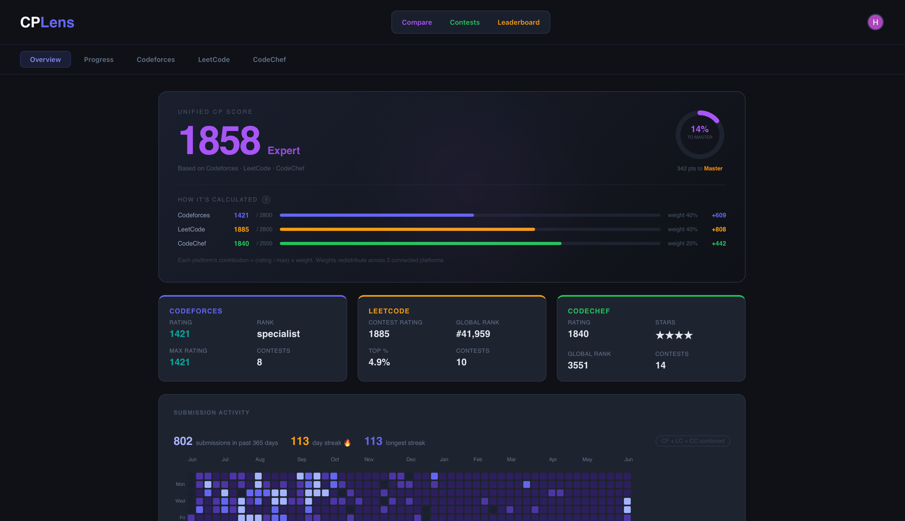
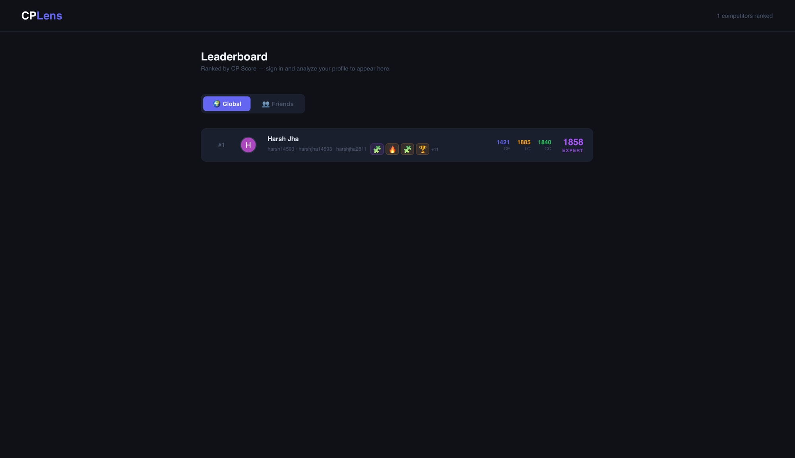
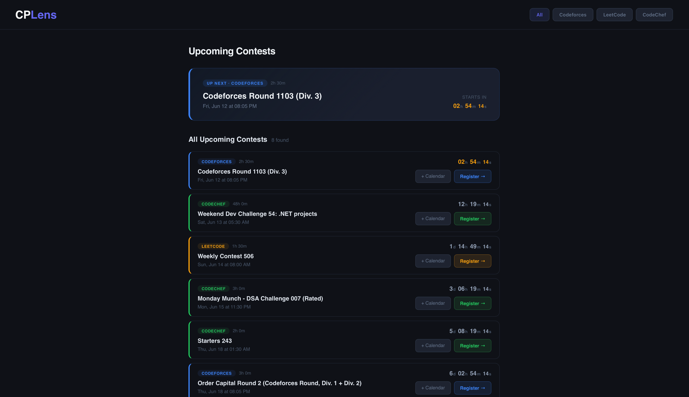
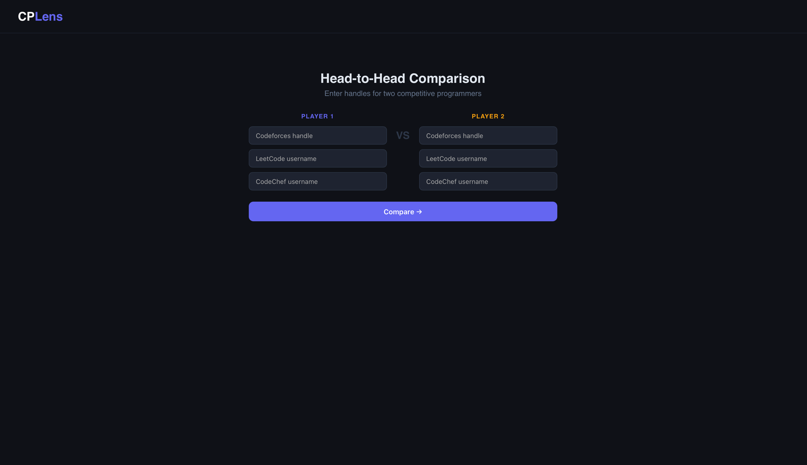

# CPLens

> Unified competitive programming analytics across Codeforces, LeetCode, and CodeChef.

[](https://cplens.vercel.app)
[](https://cplens-api.onrender.com)
[](https://react.dev)
[](https://fastapi.tiangolo.com)
[](https://firebase.google.com)

CPLens aggregates your contest history, submission patterns, rating trends, and skill gaps from all three CP platforms into one dashboard — with an AI study plan, a real-time global leaderboard, a friends board, goal tracking, head-to-head compare, and a shareable profile card.

---

## Preview



<details>
<summary>More screenshots</summary>





</details>

---

## Features

### Dashboard
- **CP Score** — composite 0–3000 score weighted across CF (40%), LC (40%), CC (20%) with tier labels (Beginner → Legendary). Weights redistribute to connected platforms only, so single/dual-platform users are scored fairly.
- **Rating history overlay** — CF contest rating trend rendered as a line chart; Compare page overlays both users on one chart
- **GitHub-style activity heatmap** — 365-day submission grid merged across all three platforms
- **Skill Radar** — topic accuracy across DP, Graphs, Trees, Math, Structures, Strings, Greedy, Search
- **Problem Recommendations** — weak-tag-based suggestions from CF, LC, and CC
- **AI Study Plan** — Gemini 2.5 Flash generates a personalized weekly plan across all active platforms, persisted in localStorage
- **Progress Tracker** — daily Firestore snapshots with sparkline charts and all-time rating deltas
- **Shimmer loading skeletons** — full-layout placeholder renders instantly while API data loads; header stays visible throughout
- **Per-platform error banners** — if a handle is wrong or the API is down, an inline banner identifies which platform failed with a direct "Fix handle" shortcut
- **Profile completion nudge** — signed-in users missing platforms see a banner listing which ones to add

### Social
- **Real-time global leaderboard** — all users ranked by CP Score via Firestore `onSnapshot`; updates live without refresh
- **Friends leaderboard** — search any user by CF/LC/CC handle, add to a private friends board, see your private ranked comparison; friends stored in Firestore subcollections
- **Head-to-Head Compare** — side-by-side stats, dual skill radar, CF rating history overlay, category win tally, shareable URL; accessible from Dashboard nav pre-filled with your handles
- **⚔ Challenge** — one-click button copies a pre-filled Compare URL with your handles as Player A
- **Public Profile** — shareable `/u?codeforces=handle` page, no login required

### Progression
- **Achievements** — 26 badges across 6 categories (streak, CF rating, CF contests, LC problems, LC percentile, CC stars, CP Score), 4 tiers (Bronze → Platinum), locked achievements collapsible
- **Goal Tracker** — set a target rating/score with a deadline; tracks pace (on pace / slightly behind / behind), synced to Firestore
- **Contest Calendar** — upcoming CF, LC, and CC contests with live countdown timers and Google Calendar export

### Profile
- **Edit handles** — update or add platforms from the dashboard at any time
- **GitHub README Card** — embeddable SVG card showing your ratings and CP Score tier

### Performance
- **Frontend localStorage cache** — all API responses cached for 5 min; contest data cached for 10 min. Pages feel instant on repeat visits.
- **Backend in-memory TTL cache** — CF, LC, CC analysis endpoints cached 5 min server-side; reduces external API load
- **Render keep-alive** — GitHub Actions cron pings the backend every 10 min to prevent free-tier cold starts

---

## Tech Stack

**Frontend**
- React 19 (CRA), React Router v7, CSS Modules
- Recharts — rating history, skill radar, sparklines
- Firebase Auth (Google OAuth) + Firestore — auth, leaderboard, goals, snapshots, friends
- Deployed on **Vercel**

**Backend**
- FastAPI + Uvicorn (Python 3.11)
- Codeforces REST API, LeetCode GraphQL, CodeChef HTML scraper (BeautifulSoup)
- Google Gemini `gemini-2.5-flash` — AI study plan generation
- SVG card generation with in-memory cache
- Deployed on **Render**

---

## Architecture

```
┌──────────────────────────────────────────────────────────┐
│                     React Frontend                        │
│   Dashboard │ Leaderboard │ Compare │ Contests │ Profile  │
└──────────────────────┬───────────────────────────────────┘
                       │  REST / axios
┌──────────────────────▼───────────────────────────────────┐
│                   FastAPI Backend                         │
│  /api/codeforces   /api/leetcode   /api/codechef          │
│  /api/ai           /api/card       /api/contests          │
└────────┬──────────────────┬──────────────────┬───────────┘
         │                  │                  │
   CF API (REST)    LC GraphQL API       Gemini API
                                    │
                        ┌───────────▼────────────┐
                        │   Firebase (client)     │
                        │   Auth + Firestore      │
                        │   leaderboard / goals   │
                        │   snapshots / friends   │
                        └─────────────────────────┘
```

---

## Local Setup

**Backend**
```bash
cd backend
python -m venv venv && source venv/bin/activate
pip install -r requirements.txt

# backend/.env
GEMINI_API_KEY=your_key_here
ALLOWED_ORIGINS=http://localhost:3000

uvicorn main:app --reload
```

**Frontend**
```bash
cd frontend
npm install

# frontend/.env.local
REACT_APP_API_URL=http://localhost:8000
REACT_APP_FIREBASE_API_KEY=...
REACT_APP_FIREBASE_AUTH_DOMAIN=...
REACT_APP_FIREBASE_PROJECT_ID=...
REACT_APP_FIREBASE_STORAGE_BUCKET=...
REACT_APP_FIREBASE_MESSAGING_SENDER_ID=...
REACT_APP_FIREBASE_APP_ID=...

npm start
```

---

## Environment Variables

| Variable | Where | Description |
|---|---|---|
| `GEMINI_API_KEY` | backend `.env` | Google AI Studio key |
| `ALLOWED_ORIGINS` | backend `.env` | Comma-separated CORS origins |
| `REACT_APP_API_URL` | frontend `.env.local` | Backend base URL |
| `REACT_APP_FIREBASE_*` | frontend `.env.local` | Firebase project config |

---

## GitHub README Card

Add your CPLens stats to any GitHub profile README:

```markdown
[](https://cplens.vercel.app/u?codeforces=YOUR_CF_HANDLE)
```

---

## Firestore Rules

```
rules_version = '2';
service cloud.firestore {
  match /databases/{database}/documents {
    match /users/{uid}/{document=**} {
      allow read, write: if request.auth.uid == uid;
    }
    match /leaderboard/{uid} {
      allow read: if true;
      allow write: if request.auth.uid == uid;
    }
  }
}
```

---

## Project Structure

```
cplens/
├── backend/
│   ├── main.py                   # FastAPI app, CORS, router registration
│   ├── cache.py                  # In-memory TTL cache shared across routers
│   ├── Procfile                  # Render deploy: uvicorn main:app
│   ├── requirements.txt
│   ├── routers/
│   │   ├── codeforces.py         # User info, contest history, analysis
│   │   ├── leetcode.py           # Profile, submission calendar, contests
│   │   ├── codechef.py           # Rating, stars, contest history (scraper)
│   │   ├── ai.py                 # Gemini study plan (multi-platform)
│   │   ├── card.py               # SVG profile card with 1h cache
│   │   ├── contests.py           # Upcoming CF + LC + CC contests
│   │   └── recommendations.py   # Weak-tag problem suggestions
│   └── analysis/
│       └── engine.py             # Tag stats, heatmap, insights
└── frontend/
    └── src/
        ├── pages/
        │   ├── Dashboard.js      # Main analytics hub
        │   ├── Leaderboard.js    # Global + friends ranked boards
        │   ├── Compare.js        # Head-to-head with radar chart
        │   ├── Contests.js       # Calendar + live countdowns
        │   └── PublicProfile.js  # Shareable public view
        ├── components/
        │   ├── CPScore.js        # Composite score, tier, ring
        │   ├── Achievements.js   # 26 badges, 4 tiers, collapsible locked section
        │   ├── GoalTracker.js    # Deadline-based rating goals
        │   ├── StudyPlan.js      # AI-generated weekly plan
        │   ├── Skeleton.js       # Shimmer loading skeletons for all Dashboard sections
        │   ├── ActivityHeatmap.js
        │   ├── ProgressTracker.js
        │   ├── SkillRadar.js
        │   └── PlatformCard.js
        ├── contexts/
        │   └── AuthContext.js    # Google OAuth, handle persistence
        ├── api/
        │   └── index.js          # Axios client with localStorage TTL cache
        └── utils/
            ├── progress.js       # Firestore: snapshots, leaderboard, goals, friends, onSnapshot
            └── cfColors.js       # Canonical CF rank color map
```
